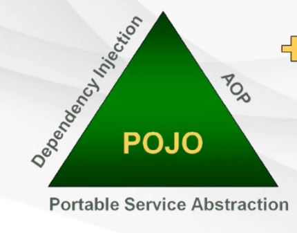

** T아카데미의 Spring Framework Basic 강의를 들으면서 공부한 것을 정리했습니다.

# 1. Spring framework 개요

- Spring framework란?
    - java enterprise 개발을 편하게 해주는 오픈소스 lightweight application framework , IoC 컨테이너
        - lightweight : tomcat 과 같은 단순한 웹컨테이너에서도 고급 기술을 대부분 사용 가능
        - enterprise 개발에 용이 : 개발자 low level(보안,인증,transaction 처리)에 많이 신경쓰지 않으면서 business logic에만 전념 가능
        - IoC (Inversion of Control-제어의 역전) : 인스턴스 life cycle 제어 권한을 컨테이너 역할을 해주는 framework에게 넘긴다. Spring 컨테이너는 DI를 통해 IoC를 지원

- Spring Frmework 전략
    - Spring 삼각형 : enterprise 개발의 복잡함을 상대하는 spring의 전략
     
    
     

        - <b>Portable Service Abstraction(서비스 추상화</b>) : 트랜잭션 추상화, OXM(Object XML Mapping) 추상화 등 low level의 기술적 복잡함은 추상화해서 interface로 분리 -> 개발자는 interface를 사용
        - <b>DI(dependency injection-의존성 주입)</b> : DI는 유연하게 확장 가능한 객체를 만들어 두고 그 관계는 Container에서 동적으로 설정해준다. 객체 간의 의존관계는 XML, annotation을 통해 설정
        - <b>AOP(Aspect Oriented Programming-관점 지향 프로그래밍)</b> : business 로직 코드에 남아있는 기술 관련 코드를 분리해서 별도의 모듈로 만들고 런타임에 weaving 해주는 기술. OOP를 support해주는 개념. 
        - <b>POJO (Plain Old Java Object)</b> : 특정 환경이나 규약에 종속되지 않고 재활용될 수 있는 방식으로 설계된 객체 (부모 클래스를 상속받는 객체는 부모 클래스의 규약을 따라야하므로 POJO가 아니다.) 

- Spring Framework 특징
    - <b>IoC 컨테이너 역할</b> : java 객체의 life cycle 관리
    - <b>DI 지원</b> : xml파일, annotation을 통해 객체 간 의존관계 설정
    - <b>AOP 지원</b> : 트랜잭션, 로깅, 보안 등 공통적으로 필요한 모듈들을 business 로직과 분리해서 적용 가능
    - <b>POJO 지원</b> : Spring 컨테이너에 저장되는 객체들은 특정 인터페이스를 구현하거나 특정 클래스를 상속받지 않아됨
    - <b>트랜잭션 처리를 위한 일관된 방법 지원</b> : 어떤 트랜잭션을 사용하던 xml, annotation을 통해 관리하므로 트랜잭션 구현에 상관없이 동일한 코드 사용 가능
    - <b>Persistence와 관련된 API 지원</b> : MyBatis, Hibernate 등 db처리를 위한 ORM(Object Relational Mapping) 연동 지원

- Spring Framework를 구성하는 기능 요소
    - <b>Spring Core</b> : Spring 컨테이너 역할을 하는 클래스로 이루어짐. BeanFactory는 Spring의 기본 컨테이너
    - <b>Spring AOP</b> : AOP모듈을 통해 Aspect를 개발할 수 있는 기반을 제공
    - <b>Spring ORM</b> : ORM 프레임워크를 Spring 기능과 조합해서 사용할 수 있도록 해줌
    - <b>Spring DAO</b> : JDBC에 대한 추상화 계층
    - <b>Spring Web</b> : 웹어플리케이션 개발에 필요한 기본 기능 제공, Struts 같은 다른 웹애플리케이션 프레임워크와의 통합을 지원
    - <b>Spring Context</b> : Spring Core의 BeanFactory 개념을 확장한 것
    - <b>Spring WebMVC( Model-View-Controller )</b> :  application logic과 web application을 분리해서 개발할 수 있도록 제공해주는 개념

## 더 공부할 부분
---
MVC 개념